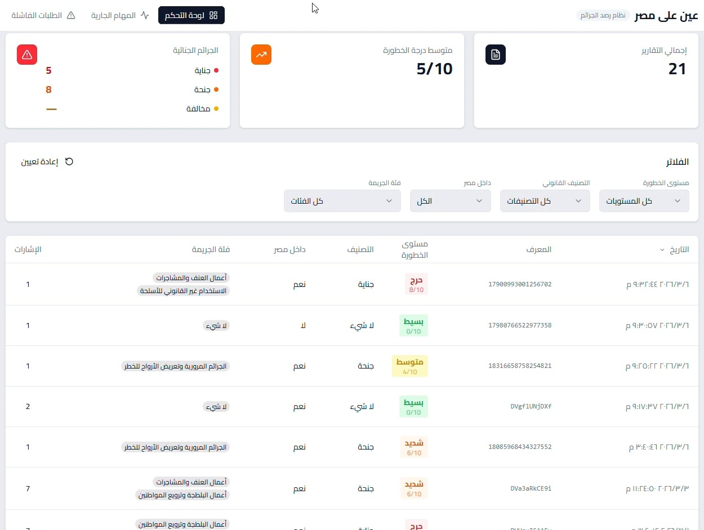
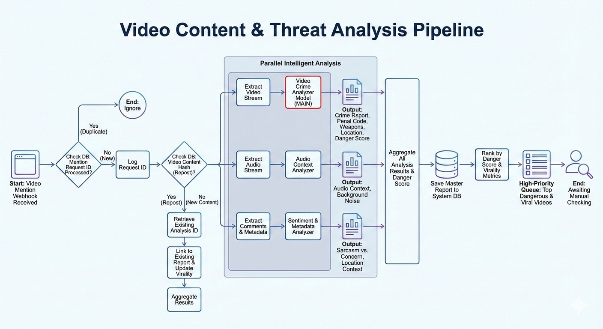

# Project Ain: Cybercrime Monitoring System

## Overview
## 🎥 Demo Video

## Pipeline

Project Ain (Eye) is a sophisticated ongoing cybercrime monitoring system designed for the Egyptian government. It serves as a proactive initiative to help the government identify, analyze, and report on trending and viral cybercrimes posted on social media platforms. By leveraging AI and data analysis, this system provides actionable intelligence to combat online criminal activities.

## How It Works

The system operates through a multi-stage pipeline:

1.  **Real-time Data Ingestion**: Using Meta Webhooks, the system monitors social media for posts where official government accounts are tagged.

2.  **Content Extraction**: When a relevant post is identified, the system automatically extracts video and audio content for analysis and compares duplicates using customized video perceptual hashing.

3.  **AI-Powered Analysis**:
    *   **Video Captioning**: AI models analyze video content to generate textual descriptions of the scenes and actions.
    *   **Audio Transcription**: Audio tracks from videos are transcribed into text.
    *   **Location Approximation**: Model predicts approximate location and governate in egypt from known landmarks
    *   **car plate detection and matching**: detecting car plate numbers and matching it against egyptian governates or abroad countries
    *   **comments sentiment analysis and context enrichment**: Model analyzes bulk video comments to understand crime context or sentiment detection contributes to final danger score

4.  **Legal Framework Matching**: The extracted text from both video and audio is semantically compared against a specialized vector store. This vector store contains a comprehensive database of Egyptian cybercrime laws (kanoun el 3okoubat el masri), allowing the system to identify potential violations and rule breaks.

## Vision

Project Ain aims to provide the Egyptian government with a powerful tool to maintain digital safety and enforce cyber laws effectively. By automating the process of detection and analysis, it allows for a rapid and informed response to the ever-evolving landscape of online crime.
